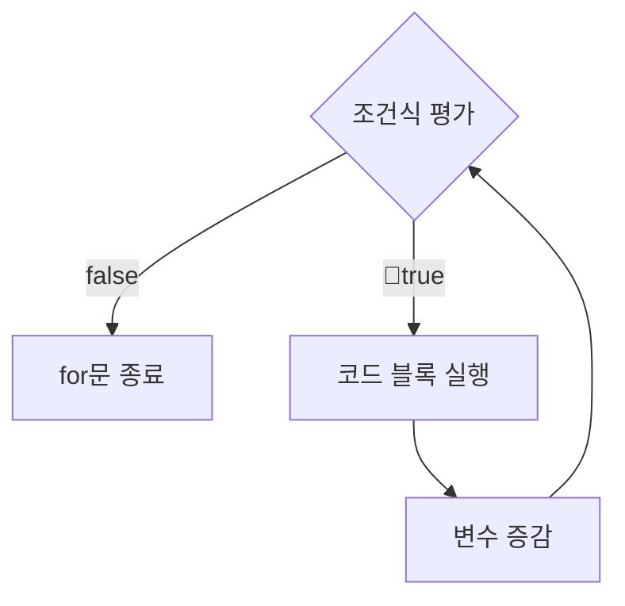
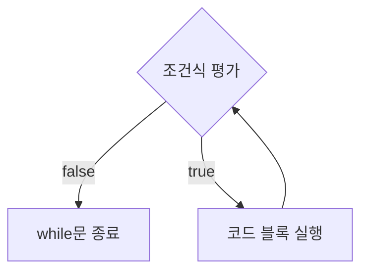
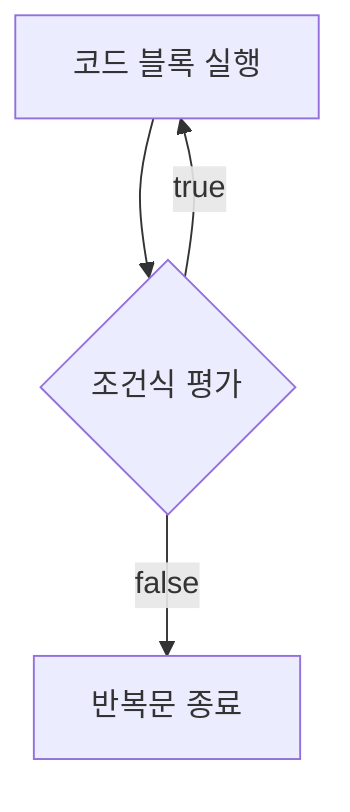

# 제어문이란?
- 코드의 실행 흐름을 인위적으로 제어할 수 있는 코드 블록

# 블록문
- 0개 이상의 문을 중괄호로 묶은 것
- 코드 블록, 블록이라고 부름
- 하나의 실행 단위로 취급
- 단독 사용가능
- 일반적으로 제어문이나 함수를 정의할 때 사용
```js
// 블록문
{
	var foo = 10;
}

// 제어문
var x = 1;
if(x < 10) {
	x++;
}

// 함수 선언문
function sum(a, b) {
	return a + b;
}
```

# 조건문
- 조건식의 평가 결과에 따라 코드 블록의 실행을 결정하는 제어문
## `if...else` / `else if`
```js
if(조건식) {
	// 조건식이 참일 경우 실행되는 코드 블록
} else {
	// 조건식이 거짓일 경우 실행되는 코드 블록
}
```
## `switch`
```js
switch(표현식) {
	case 표현식1:
		// switch문의 표현식과 표현식1이 일치하면 실행될 블록
		break;
	// ...
	default:
		// switch문의 표현식과 일치하는 case문이 없을 때 실행될 블록
		break;
}
```

# 반복문
- 조건식이 거짓일 때까지 코드 블록을 실행
## `for` 문
```js
for (변수 선언문 또는 할당문; 조건식; 증감식) {
	// 조건식이 참일 경우 반복 실행될 블록
}
```
- for문의 모든 식은 옵션
- 옵션을 하나도 작성하지 않으면 무한 루프 동작
- 반복 획수가 명확할 때 주로 사용

## `while` 문
- 조건식을 평가한 결과가 참일 경우 코드 블록 실행
- 반복 횟수가 불명확할 때 주로 사용

## `do...while` 문
- 코드 블록을 실행한 뒤에 조건식을 평가 ⇒ 코드 블록이 무조건 한 번 이상 실행


# `break` 문
- [레이블문](https://developer.mozilla.org/en-US/docs/Web/JavaScript/Reference/Statements/label), 반복문, switch문 에서 코드 블록 탈출
- 그 외의 경우에 사용하면 SyntaxError 발생

# `continue` 문
- 반복문의 코드 블록 실행을 현 지점에서 중단하고 증감식으로 실행 흐름 이동